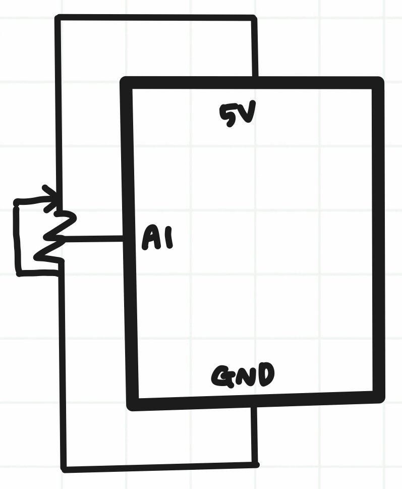
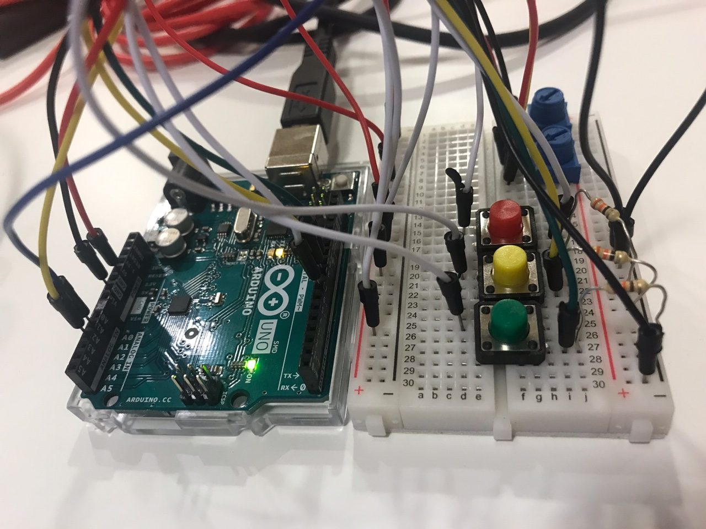
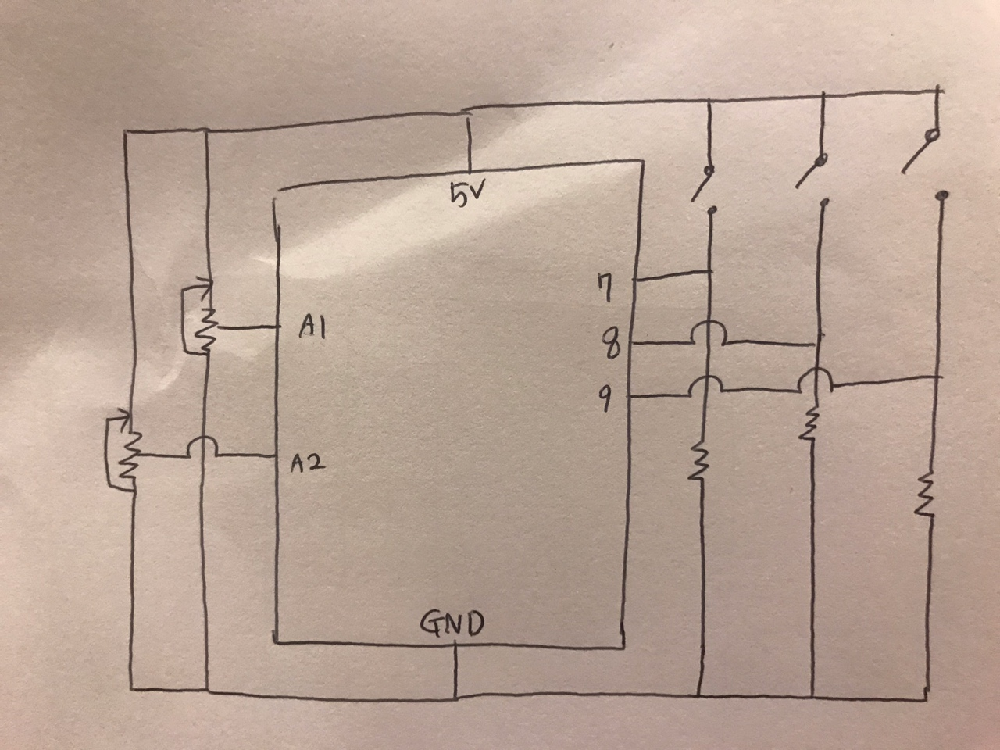

# Proposal
## Etch a Sketch! 

Etch a Sketch is a drawing toy that displays lines based on how user rotates two knobs.  
One knob controls horizontal movement and another controls vertical movement.  
When both knobs are controlled together, it draws a diagonal line. Please look at the YouTube link attached at the end.  

For the final project, I would like to make an Etch a Sketch drawing board with Arduino and Processing.  
Processing will display the picture drawn and I will build two physical knobs and color buttons with Arduino.  
A user can 1) choose the color of the pen with color buttons and 2) draw with two potentiometer knobs.  
When one is done with drawing, one can click "Erase" button on Processing and reset the board.  

One of the concerns I have about the project is the fact that potentiometer knobs do not turn all the way around.  
Once the knob hits the end, it must be turned the other way around, which might mess up the drawing.  
For the convenience of the user, I will check out larger potentiometers for the final production.  

## Reference
Example Video: https://www.youtube.com/watch?v=q4CTyWwQrMo&t=15s  
Example Photo: https://en.wikipedia.org/wiki/Etch_A_Sketch

# 2021.11.28 
## Agenda
- Create a drawing board with one potentiometer that draws horizontal lines (success)

## Circuit Photo and Schematic

## Reflection
Controlling with one potentiometer was a lot easier than I expected. I need to borrow or check out another potentiometer for vertical control.  
Thickness of the pen and the size of the canvas can be controlled by changing the variable value.  
One problem I have noticed is that if I turn the knob too fast, it does not draw a straight line but rather a dotted line.  
I tried removing delay and the handshake part, but the problem is not solved. I need to ask this question in class.  

# Upcoming Agenda
- Add second potentiometer that controls vertical movement
- Add color buttons to control the color of the pen
- Start page: ENTER to open canvas, click to erase canvas
- Display like a real Etch a Sketch machine
- Optional: user can click on buttons displayed on Processing to choose the canvas size and pen thickness  

# 2021.12.07
## Agenda 
- Add second potentiometer that controls vertical movement
- Add color buttons to control the color of the pen
- Display like a real Etch a Sketch machine
- Click to erase canvas

## Circuit Photo and Schematics

The convention is to put all the inputs on the left hand side, but I divided them in two sides for better comprehension of the circuit. 

## Video
https://user-images.githubusercontent.com/57341200/144876667-6cd5299e-a849-4bda-980f-7ebf0754c453.mp4

## Reflection
I borrowed another potentiometer from one of my friends and added a vertical control. 

## Upcoming Agenda
- Try to fix the error
