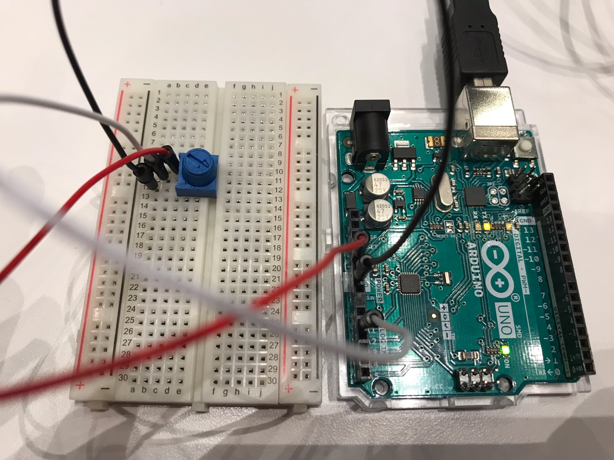

# Proposal
## Etch a Sketch! 

Etch a Sketch is a drawing toy that displays lines based on how user rotates two knobs.  
One knob controls horizontal movement and another controls vertical movement.  
When both knobs are controlled together, it draws a diagonal line. Please look at the YouTube link attached at the end.  

For the final project, I would like to make an Etch a Sketch drawing board with Arduino and Processing.  
Processing will display the picture drawn and I will build two physical knobs and color buttons with Arduino.  
A user can 1) choose the color of the pen with color buttons and 2) draw with two potentiometer knobs.  
When one is done with drawing, one can click "Erase" button on Processing and reset the board.  

One of the concerns I have about the project is the fact that potentiometer knobs do not turn all the way around.  
Once the knob hits the end, it must be turned the other way around, which might mess up the drawing.  
For the convenience of the user, I will check out larger potentiometers for the final production.  

## Reference
Example Video: https://www.youtube.com/watch?v=q4CTyWwQrMo&t=15s  
Example Photo: https://en.wikipedia.org/wiki/Etch_A_Sketch

# 2021.11.28 
## Agenda
- Create a drawing board with one potentiometer that draws horizontal lines (success)

## Circuit Photo and Schematic

## Reflection
Controlling with one potentiometer was a lot easier than I expected. I need to borrow or check out another potentiometer for vertical control.  
Thickness of the pen and the size of the canvas can be controlled by changing the variable value.  
One problem I have noticed is that if I turn the knob too fast, it does not draw a straight line but rather a dotted line.  
I tried removing delay and the handshake part, but the problem is not solved. I need to ask this question in class.  

[Change in plan]
- instead of continuously drawing dots, try connecting two positions (one being the current position, the other being the previous position)

# Upcoming Agenda
- Add second potentiometer that controls vertical movement
- Add color buttons to control the color of the pen
- Start page: ENTER to open canvas, click to erase canvas
- Display like a real Etch a Sketch machine
- Optional: user can click on buttons displayed on Processing to choose the canvas size and pen thickness  

# 2021.12.07
## Agenda 
- Add second potentiometer that controls vertical movement
- Add color buttons to control the color of the pen
- Display like a real Etch a Sketch machine
- Click to erase canvas and play sound effect

## Circuit Photo and Schematics

The convention is to put all the inputs on the left hand side, but I divided them in two sides for better comprehension of the circuit. 

## Video
https://user-images.githubusercontent.com/57341200/144876667-6cd5299e-a849-4bda-980f-7ebf0754c453.mp4

## Reflection
I borrowed another potentiometer from one of my friends to add a vertical control. 
Arduino sends three different information to Processing: vertial position, horizontal position, and the pen color. 
I combined three numbers in Arduino and sent a single string to Processing. 
In Processing, I splitted a string and retrieved needed information. 

I have this error "serialEvent() disabling COM3, null" randomly popping up. Here are things I have tried.
1) Detaching circuit from Arduino: error still pops up
2) Tried with different Arduino cable: error still pops up

The program works again when I unplug the Arduino and plug it in again or when I restart the program. 

[Change in plan]
- Instead of adding Start button, work more on fixing the error

## Upcoming Agenda
- Try to fix the error

# 2021.12.11
## Agenda
- Try to fix the error

## Circuit Photo and Schematics
Same with 2021.12.07

## Video
Same with 2021.12.07

## Reflection
I still have not figured out why this error appears. I talked with Michael but the problem is not yet solved. 
Here are things I have tried:
1) Changing all resistors to 10k Ohms from 300 Ohms: error still appears
2) Connecting to other computer: error still appears 

It seems like codes--both Arduino and Processing--do not have any problem. 
Circuit looks fine as well. 

[Change in plan]
- Stop working on the error: problem is not identifiable and the program still works when I replug the Arduino
- Instead make the display more advance by adding a background music

## Upcoming Agenda
- Background music plays when drawing 

# 2021.12.13
## Agenda
- Background music plays when drawing 
- Install in the arts center

## Circuit photo and schematics
Same with 2021.12.07

## Video 

## Reflection
I love the Toy Story theme of the project! Excited for the showcase :)

# 2021.12.14
## Agenda
- Final installation (check out monitor and mouse)
- Posters

## Reflection
[Things for tomorrow]
- turn off sleeping mode
- give out candies!
- check the program before lunch

