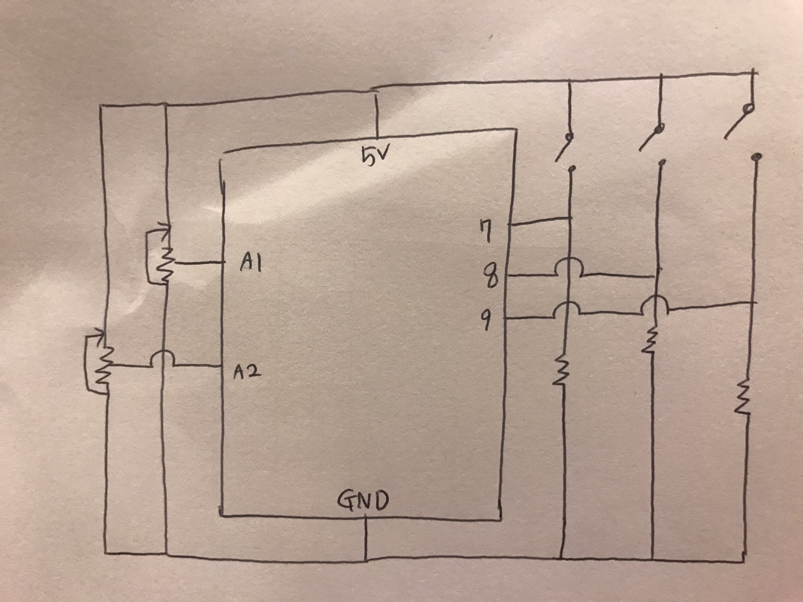

# Etch a Sketch! 

Etch a Sketch is a drawing toy that displays lines based on how user rotates two knobs.  
One knob controls horizontal movement and another controls vertical movement.  
When both knobs are controlled together, it draws a diagonal line. Please look at the YouTube link attached at the end.  

For the final project, I would like to make an Etch a Sketch drawing board with Arduino and Processing.  
Processing will display the picture drawn and I will build two physical knobs and color buttons with Arduino.  
A user can 1) choose the color of the pen with color buttons and 2) draw with two potentiometer knobs.  
When one is done with drawing, one can click mouse and reset the board.  

# Circuit Schematic

# Photos and Videos

https://user-images.githubusercontent.com/57341200/146452869-27a509a8-00ae-4052-9894-19cfa42077e7.mp4

https://user-images.githubusercontent.com/57341200/146452876-5bedb4f5-0389-4101-87f5-178e57445aaa.mp4

# Reflection 
- major problems, solutions
- clever/difficult things about your project
