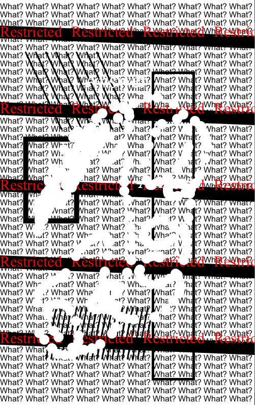

While it may seem like a still picture, a user can choose where to print "Answer" by clicking mouse.  
User can also erase the canvas after done printing "Answer" twice. 

**References**
http://learningprocessing.com/examples/chp17/example-17-01-displaytext  
https://processing.org/reference/point_.html  
https://processing.org/reference/quad_.html  
https://processing.org/reference/strokeWeight_.html  

**Reflection**
I started with drawing a rough design on a paper before actually writing any codes. First, I thought of the size of the canvas and then came up with approximate coordinates of the shapes I want to put in my design. After I started actual coding, I realized some parts of my design cannot be drawn only with what we've learned in class. I searched Google for such things as drawing quadrangle (not rectagle), drawing text, and so on. Learning new tools was not hard as there were more than enough Processing sources on the Internet. One thing I couldn't figure out was how to draw text in a tilted angle. I initially wanted to draw black rectangles and "Restricted" as if someone has taped it like a police line, but I couldn't figure out how to tilt a text.  
In general, I had so much fun trying different things on Processing and seeing my design displayed in real. 
