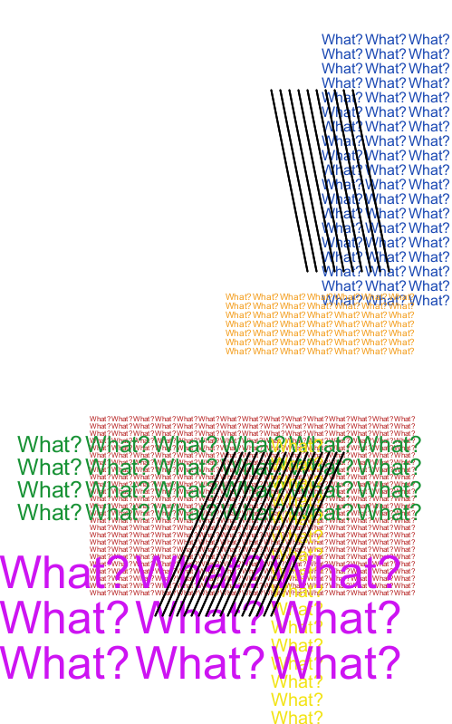

I created two classes--one for text squares and one for stripe patches--for this artwork. 
A user can choose the font size, color, square size, and the location of the text boxes. 
One can also choose the direction--vertical or horizontal--and the speed of the movement.

For the tilted stripe patches, user can choose the density, angle, location, and the direction.

I struggled a little bit when assigning/naming variables within a class, but I was able to understand the system after creating several simple classes based on the template in the lecture notes. I first created a class of static text boxes and then complicated the program by adding functions bit by bit. 

I also had fun designing a code that will retrieve a desired outcome based on the user input. 
When I created a similar artwork without using classes, I could write any code as long as it draws the same shape. 
Using classes, however, I had to think of coherent variables and functions that will draw the shape whatever the value a user puts.

In general, I enjoyed using classes because it halved the length of my code and made debugging easier.
