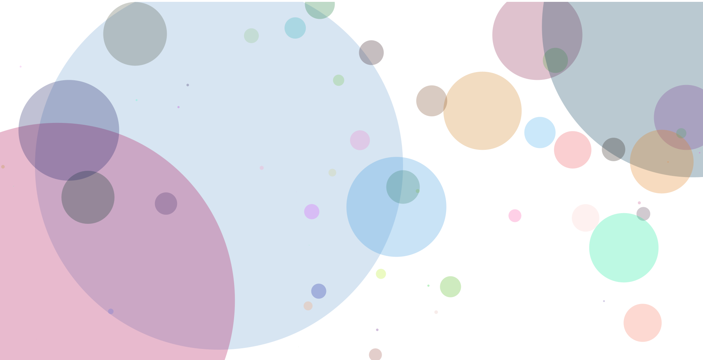

Each circle represents different causes of death of French males in year 2001.  
The sizes of circles are determined by the number of death for each cause.  
Color and location are randomly generated. The program, however, does not draw circles on the same location again.  

To generate random locations that do not repeat, I first tried generating a random number and appending it to an array. I tried using functions such as .contains() but I couldn't figure out the right grammar. After few trials, I changed the approach to generating an ordered integer list and then shuffling the order. I included websites I referred to at the end of this document. 

I want to try other things with data visualization in the future. One of the several ideas I had was drawing a circle time table based on the data of how people spend their time in a day. If we draw different pies in trnasluscent color, we might be able to see how much time people generally spend doing certain things (The more opaque, the longer time spent doing that activity) 

**Reference**

https://processing.org/reference/IntList_shuffle_.html  

https://www.geeksforgeeks.org/list-get-method-in-java-with-examples/
