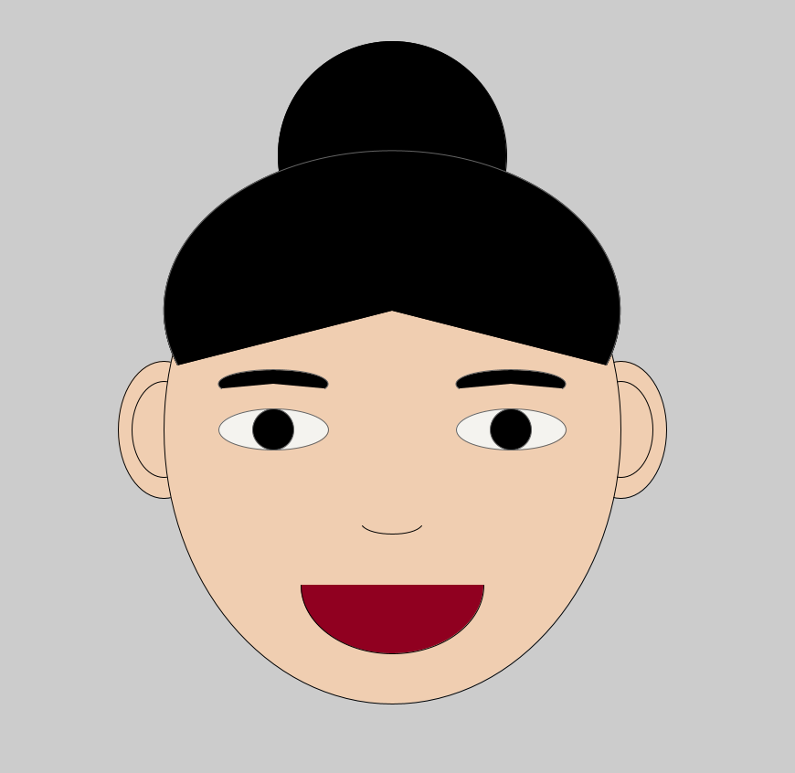

It was a little difficult to understand how ellipses are drawn on the canvas--especially how the angle works--but after trying several floats, I was able to get the hang of it. I wonder if it's possible to connect to arcs and fill in the color in between those two (like a crescent shape). I also had fun trying different colors. Even though my final portrait has only four colors--black, white, burgundy, and my skin color--I had fun finding the exact color I want. Trying different figures for RGB and seeing the changes helped me get a sense of how color composition works. 
