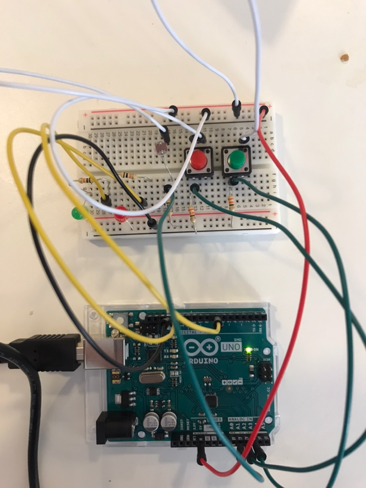

In your Github repository, create a new folder named Nov11
Upload your Arduino program into the new folder, with the extension .ino.
Use COMMAND T or CONTROL T to indent your code properly
Your program should be well commented and organized.

Excellent names for variables
Excellent names for constants such as pin numbers
Excellent names for functions, if you make any

Upload a photograph of your project to our Discord channel

Create a README.md in the new folder and include :
The photograph
A link to a short video
A schematic of your circuit (hand-drawn is fine)

Describe:
Your concept
Your process
Any problems and, if any, solutions or workarounds
Anything interesting you discovered or learned

## Concept
When green button is pressed, the green led blinks "love" in morse code. 
When red button is pressed, the red led blinks "hate" in morse code.

When you cover the LDR sensor, leds blink faster. 
When you uncover the LDR sensor, leds blink slower.

## Process
I started from a simple switch that turns on the led when pressed. I added another led and made them blink. 
Then I added LDR and checked LDR value using Serial. I looked for the morese code of "love" and "hate" and
coded them. 

## Problems 
When building my circuit, I started from building a simple switch that turns on the led when pressed.
I built the same circuit as I did for the last project (or I thought I did) but for some reason, 
the led stayed on whether the button is pressed or not. I used Serial to check if the circuit properly reads the button value.
It turned out that the circuit reads the button is always pressed (always returning 1). 

I couldn't figure out the problem myself, so I just unplugged everything and rebuilt the circuit 
from scratch based on the schematic in the lecture notes. Fortuantely it worked. 

Another problem I couldn't solve is making the buttonState always HIGH once pressed.
I tried the code below:
boolean buttonPressed = false;
if (buttonState == HIGH){
  buttonPressed = true;
}

I placed it in various different locations (outside any function, in the setup function, in the loop function).
And I used Serial to check if the system reads the value properly, but it never read the button as pressed.

