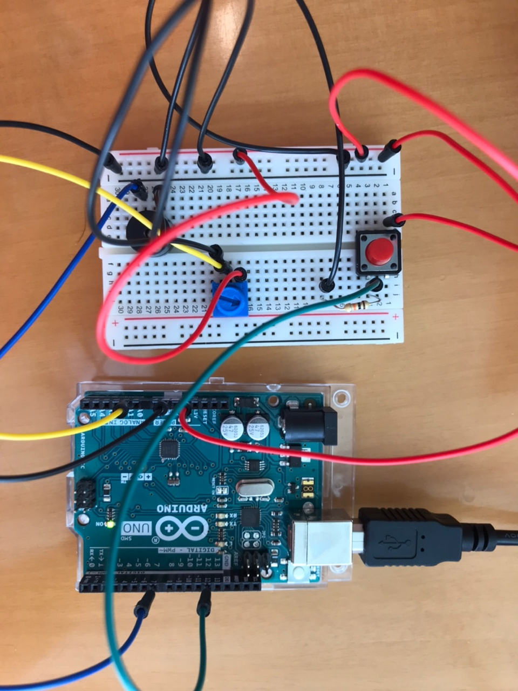

## Concept
You can control the pitch of the sound with potentiometor. 
The speaker stops buzzing once button is pressed.

## Process
I started from reading the value of potentiometer. I then added speaker and checked whether the speaker pin
properly reads the value from potentiometer. Once I was able to control the pitch, I added switch.

## Problems 
- How do I keep the buttonState at HIGH? 
  To stop the sound once button is pressed, I first tried creating buttonPressed boolean value. 
  buttonPressed is false initially, but once button is pressed (buttonState turns HIGH) it turns to true.
  I then created if function that stops playing once buttonPressed true but it didn't work.
  I had to use exit() function to break out of the loop. Is there an another way around this?
  
- The sound from the buzzer does change according to the value from the potentiometer. 
  But when the pitch is low, the sound seems to tremble a little. I'm not sure why this happens

