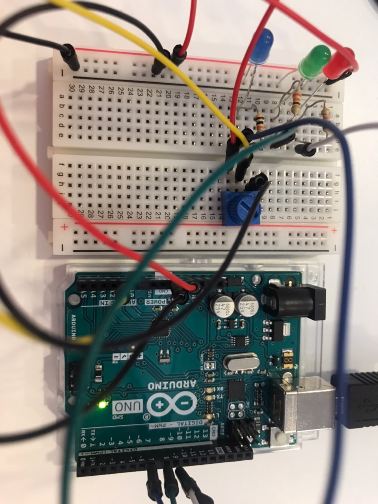
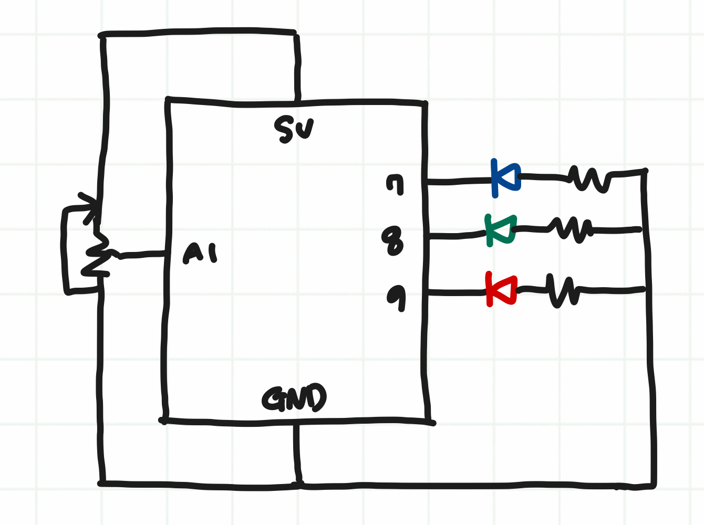

## Concept
An user can choose a color by clicking mouse on Processing and control the brightness of the color through Arduino.  
Whatever color is selected, the according color LED pin is turned on as well. 

https://user-images.githubusercontent.com/57341200/143400296-5ca3885e-5912-43d0-beb1-1b01cef36ce0.mp4

## Process
I started with a simple program that controls only the brightness (from black to white) with Arduino potentiometer. 
Then I wrote a Processing code that decides which color to be displayed based on how many times mouse is clicked. 

## Reflection 
I initially wanted to control the entire color range only with a potentiometer.  
However, I could not figure out how to control all three numbers (R, G, B) with one potentiometer.  
I instead decided to control color within Processing with mouse click.  
This extra credit really helped me understand the communication better because I had to come up with the code that executes what I want. 

