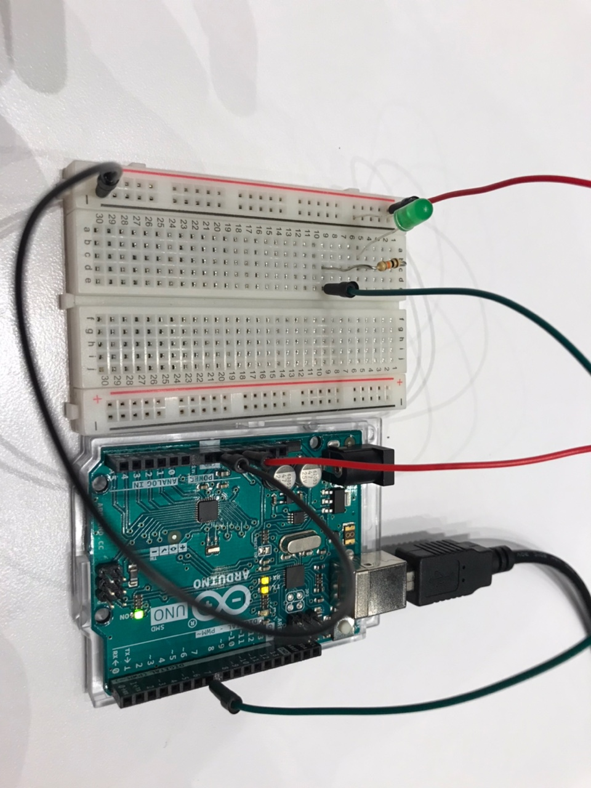

## Concept
When mouse is clicked Processing screen turns bright and turns on the LED.

https://user-images.githubusercontent.com/57341200/143300291-b274263d-c8cc-4a21-bf6c-6bbb7a98d4bc.mp4

## Process
I first created a Processing program that changes the color when mouse is clicked. 
On the even counts of the click, the screen displays black.
On the odd counts of the click, the screen displays white. 

After I succeeded doing so, I added a code to send the message to Arduino.
When the screen displays black, Processing sends 0 to Arduino.
When the screen displays white, Processing sends 255 to Arduino.

Arduino then reads from the Serial port and use that value to turn on and off the LED.

## Reflection
Building communication between Processing and Arduino from scratch was a bit of a struggle.
Even though it is a very simple program, I have learned a lot in the process and the struggle was worth it. 

