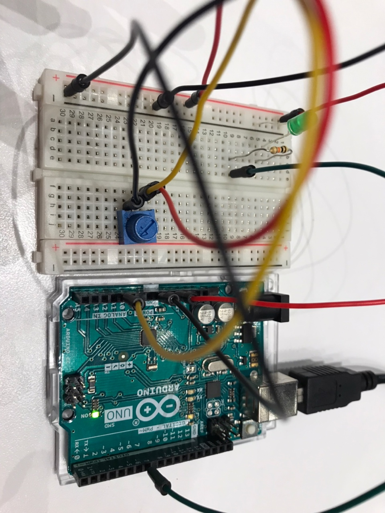

## Concept
LED lights whenever the ball touches the ground.

You can control the direction/strength of the wind with a potentiometer.

https://user-images.githubusercontent.com/57341200/143302435-dbfda9b9-5422-4661-9087-a6bb7f559a4f.mp4

## Process
I first built a program that turns on the LED whenever the ball hits bottom. 
Then I included a potentiometer in the circuit and checked if the Arduino properly reads the sensor value. 

I looked at the example code we have covered in the recorded lecture and tried my best to rewrite the code without looking. 

## Reflection 
Even though there was an example code, I tried to not look at it while building my program. 
It took longer but the process was worth going through, because now I know why certain lines are written. 
I also learned the importance of good commenting in the code! The program is not simple but I had no problem understanding it because the comments were detailed and very clear. 

