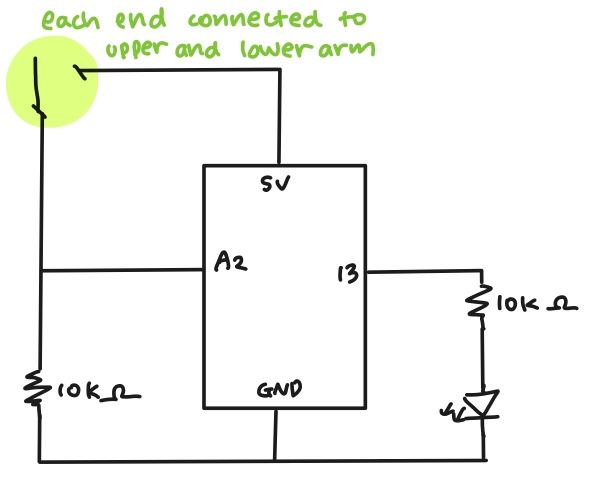

## Progress
1. Coming up with an idea was actually the hardest part for this assignment. 
   I couldn't think of a creative way until I got this idea while working out in the gym.
   I realized inner parts of my arm are touching each other whenever I bend my arm inward. 
2. Based on the circuit with one switch and one LED light that we built in class, 
   I made a similar circuit that has two wire ends instead of a switch. 
   This would work because switch is basically a device that connects and disconnects the electricity flow. 
   And it works!! (look at progress1.mp4 )
3. I connected each end of wire with aluminum foil. (I got the idea from Sonny's work. Thank you Sonny!) 
   I wrapped my upper arm and lower arm with two separate foils. They touch each other only when I bend my arm.
   I connected the wire foil with the foil wrapped around my arm. The light turns on when I bend my arm.
   
   
   
   
## Troubles & Further Questions
When I turned on the LED light by bending my arm, I could feel a light electric current passing my arm. 
I wonder why this happens, should I be more careful dealing with electricity, and so on. 
Is there any dos/don'ts while working with electric circuits?

## Reference
I did not use any reference outside class for this assignment.
